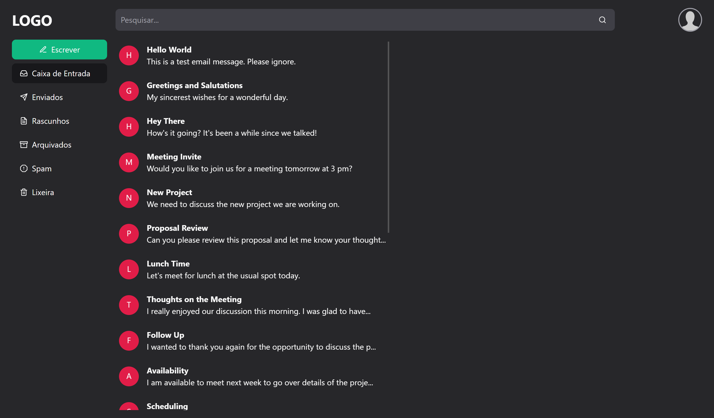

# Projeto EmailsTailwind



## 💭 Descrição

Esse projeto é um de um front-end de um sistema de email desenvolvido como parte do curso da OneBitCode. O foco principal deste projeto é proporcionar uma oportunidade de aprimorar o conhecimento e habilidades na utilização do framework Tailwind CSS, uma tecnologia amplamente adotada no desenvolvimento web moderno.

## 🧠 Funcionalidades

✔️ **Design Responsivo:** A página é otimizada para ser visualizada em diferentes dispositivos e tamanhos de tela, garantindo uma experiência de usuário consistente.

✔️ **Modo Dark/Light**: A interface alternar entre os modos escuro e claro, com base nas preferências do sistema, proporcionando uma experiência de visualização confortável.

## 🖥️ Tecnologias Utilizadas

- [React](https://react.dev) - biblioteca para interfaces de usuário
- [Vite](https://vitejs.dev) - ferramentas para front-end
- [Typescript](https://www.typescriptlang.org) - superset, linguagem baseada em javascript
- [Tailwind](https://tailwindcss.com/) - framework de classes utilitárias CSS

## 🛠️ Modificando o projeto

### Siga as seguintes instruções para instalar e poder modificar o projeto em sua máquina:

### 📋 Pré-requisitos:

Para baixar, executar e modificar o projeto, você precisa ter instalado em sua máquina:

- [Node](https://nodejs.org/en)
- Um gerenciador de pacotes, como o [PNPM](https://pnpm.io), [Npm](https://nodejs.org/en/) ou [Yarn](https://classic.yarnpkg.com/lang/en/docs/install)
- [Git](https://git-scm.com/downloads)
- Editor de código ou IDE, como o [VSCode](https://code.visualstudio.com/Download)

### 🔧 Instalação e execução

1. Clone o repositório

```bash
git clone https://github.com/aleretamero/emails-tailwind.git
```

2. Acesse a pasta do projeto

```bash
cd emails-tailwind
```

3. Instale as dependências

```bash
npm install
# ou
pnpm install
# ou
yarn install
```

4. Inicie o servidor de desenvolvimento do projeto

```bash
npm run dev
# ou
pnpm dev
# ou
yarn dev
```

Obs: o servidor iniciará na porta 5173 - acesse por: <http://localhost:5173/>

## Colaboradores 🤝🤝

| Foto                                                       | Nome                                                 |
| ---------------------------------------------------------- | ---------------------------------------------------- |
|  | [Alexandre Retamero](https://github.com/aleretamero) |

## Licença

[MIT](https://choosealicense.com/licenses/mit/)

